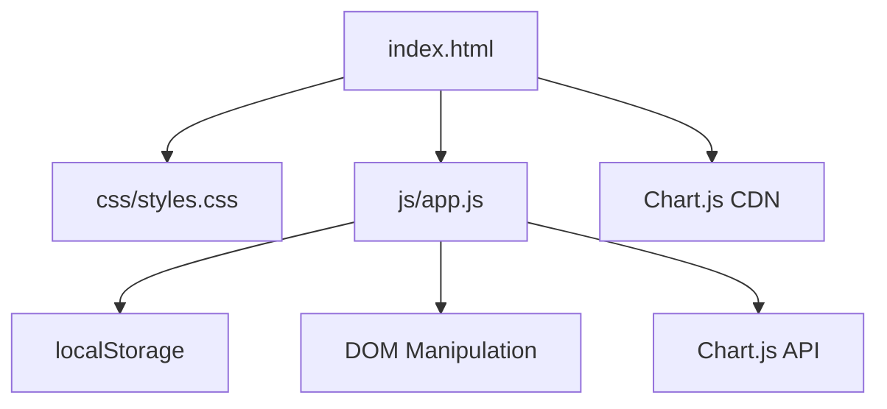

# Design Document: Expense & Budget Visualizer

## Overview

A single-page, client-side expense tracker built with vanilla HTML, CSS, and JavaScript. No build tools, no frameworks, no backend. The user opens one HTML file in a browser and can immediately add, view, and delete transactions. A pie chart (Chart.js via CDN) visualizes spending by category. All data persists in `localStorage`.

The architecture is intentionally flat: one HTML file, one CSS file (`css/styles.css`), one JS file (`js/app.js`). All logic lives in `app.js`; the HTML provides structure; the CSS handles layout and styling.

---

## Architecture



The app follows a simple reactive pattern:

1. User action (form submit / delete click) triggers a handler in `app.js`
2. Handler mutates the in-memory `transactions` array
3. Handler persists the array to `localStorage`
4. Handler calls `render()` which re-draws the transaction list, total balance, and chart

There is no virtual DOM, no state management library. The single source of truth is the `transactions` array in memory, which is always kept in sync with `localStorage`.

---

## Components and Interfaces

### HTML Structure (`index.html`)

```
<body>
  <header>          <!-- App title + total balance display -->
  <main>
    <section#form-section>   <!-- Input form -->
    <section#list-section>   <!-- Transaction list -->
    <section#chart-section>  <!-- Pie chart canvas -->
  </main>
</body>
```

Key element IDs used by `app.js`:

| ID / selector         | Purpose                                      |
|-----------------------|----------------------------------------------|
| `#total-balance`      | Displays the running total                   |
| `#expense-form`       | The add-transaction form                     |
| `#input-name`         | Item name text input                         |
| `#input-amount`       | Amount number input                          |
| `#input-category`     | Category select (Food / Transport / Fun)     |
| `#form-error`         | Inline validation error message span         |
| `#transaction-list`   | `<ul>` that holds transaction items          |
| `#empty-state`        | Message shown when list is empty             |
| `#chart-canvas`       | `<canvas>` element for Chart.js              |
| `#storage-warning`    | Warning banner shown if localStorage is off  |

### JavaScript Module (`js/app.js`)

All logic is contained in an IIFE to avoid polluting the global scope. Public surface is zero — everything is internal.

Key functions:

| Function                  | Responsibility                                              |
|---------------------------|-------------------------------------------------------------|
| `init()`                  | Entry point; loads from storage, wires event listeners, renders |
| `loadFromStorage()`       | Reads and parses `localStorage` key; returns array          |
| `saveToStorage()`         | Serializes `transactions` array to `localStorage`           |
| `addTransaction(name, amount, category)` | Validates, creates, persists, re-renders      |
| `deleteTransaction(id)`   | Removes by id, persists, re-renders                         |
| `render()`                | Orchestrates `renderList()`, `renderTotal()`, `renderChart()` |
| `renderList()`            | Rebuilds `#transaction-list` from `transactions`            |
| `renderTotal()`           | Sums amounts, updates `#total-balance`                      |
| `renderChart()`           | Aggregates by category, updates Chart.js instance           |
| `validateForm(name, amount, category)` | Returns error string or null                  |
| `isStorageAvailable()`    | Feature-detects `localStorage`; returns boolean             |

### Chart.js Integration

A single `Chart` instance is created on `init()` and stored in a module-level variable. On each `renderChart()` call, the existing chart's `data.datasets[0].data` and `labels` are updated and `chart.update()` is called — avoiding destroy/recreate on every change.

```js
// Pseudo-code
let chartInstance = null;

function renderChart() {
  const totals = aggregateByCategory(transactions); // { Food: n, Transport: n, Fun: n }
  if (chartInstance) {
    chartInstance.data.datasets[0].data = Object.values(totals);
    chartInstance.update();
  } else {
    chartInstance = new Chart(canvas, { type: 'pie', data: { ... } });
  }
}
```

---

## Data Models

### Transaction Object

```js
{
  id: string,        // crypto.randomUUID() or Date.now().toString() fallback
  name: string,      // non-empty, trimmed
  amount: number,    // positive float, parsed from input
  category: string   // one of: "Food" | "Transport" | "Fun"
}
```

### localStorage Schema

Single key: `"expense-visualizer-transactions"`

Value: JSON-serialized array of Transaction objects.

```json
[
  { "id": "abc123", "name": "Lunch", "amount": 12.50, "category": "Food" },
  { "id": "def456", "name": "Bus pass", "amount": 30.00, "category": "Transport" }
]
```

On load, the value is parsed with `JSON.parse`. If parsing fails (corrupted data), the app falls back to an empty array and logs a warning.

### Category Aggregation (for chart)

```js
// Derived at render time — not stored
{
  Food: number,       // sum of amounts where category === "Food"
  Transport: number,
  Fun: number
}
```


---

## Correctness Properties

*A property is a characteristic or behavior that should hold true across all valid executions of a system — essentially, a formal statement about what the system should do. Properties serve as the bridge between human-readable specifications and machine-verifiable correctness guarantees.*

### Property 1: Form submission round-trip

*For any* valid transaction (non-empty name, positive amount, valid category), submitting the form should result in that transaction being present in `localStorage` and appearing as an item in the rendered transaction list.

**Validates: Requirements 1.2**

---

### Property 2: Invalid inputs are rejected

*For any* form submission where at least one field is empty or invalid, the transaction count in `localStorage` should remain unchanged and a validation error message should be visible in the DOM.

**Validates: Requirements 1.3**

---

### Property 3: Form resets after valid submission

*For any* valid transaction submission, all form fields should be empty/default immediately after the submission is processed.

**Validates: Requirements 1.4**

---

### Property 4: All stored transactions are rendered

*For any* array of transactions pre-loaded into `localStorage`, after `init()` runs the number of items rendered in `#transaction-list` should equal the number of transactions in storage, and each transaction's data should be present in the DOM.

**Validates: Requirements 2.1, 6.1, 6.2**

---

### Property 5: Each rendered item displays required fields

*For any* transaction in the list, the corresponding rendered list item should contain the transaction's name, formatted amount, and category as visible text.

**Validates: Requirements 2.2**

---

### Property 6: Every rendered item has a delete control

*For any* non-empty transaction list, every rendered list item should contain exactly one delete button/control.

**Validates: Requirements 3.1**

---

### Property 7: Delete removes from storage and DOM

*For any* transaction currently in the list, activating its delete control should result in that transaction being absent from both `localStorage` and the rendered list, while all other transactions remain present.

**Validates: Requirements 3.2, 3.3**

---

### Property 8: Displayed total equals arithmetic sum

*For any* set of transactions, the numeric value shown in `#total-balance` should equal the sum of all transaction amounts, rounded to two decimal places.

**Validates: Requirements 4.1, 4.2**

---

### Property 9: Chart data matches per-category sums

*For any* set of transactions, the data values in the Chart.js dataset should equal the sum of amounts for each category (Food, Transport, Fun) computed from the current transaction array.

**Validates: Requirements 5.1, 5.2**

---

## Error Handling

| Scenario | Handling |
|---|---|
| `localStorage` unavailable | `isStorageAvailable()` detects this on init; `#storage-warning` banner is shown; app still runs in-memory for the session |
| Corrupted `localStorage` data | `JSON.parse` wrapped in try/catch; falls back to empty array; logs warning to console |
| Amount is not a valid number | `validateForm()` rejects; error shown inline; no transaction created |
| `crypto.randomUUID` unavailable (old browsers) | Falls back to `Date.now().toString() + Math.random()` for ID generation |
| Chart.js CDN fails to load | `window.Chart` check before instantiation; graceful degradation — chart section hidden, rest of app functional |

---

## Testing Strategy

### Dual Testing Approach

Both unit tests and property-based tests are required. They are complementary:

- Unit tests catch concrete bugs at specific inputs and edge cases
- Property tests verify general correctness across the full input space

### Unit Tests (specific examples and edge cases)

- Form renders with all three required fields present (Requirement 1.1)
- Empty state message is shown when transaction list is empty (Requirement 2.3)
- `localStorage` unavailable warning is displayed when storage is mocked as unavailable (Requirement 6.3)
- Corrupted `localStorage` value falls back to empty array without throwing
- Chart.js absence is handled gracefully

### Property-Based Tests

Use **fast-check** (JavaScript PBT library) loaded via CDN or npm for test environments.

Each property test must run a minimum of **100 iterations**.

Each test must include a comment tag in the format:
`// Feature: expense-budget-visualizer, Property N: <property text>`

| Property | Test description |
|---|---|
| Property 1 | Generate random valid (name, amount, category) triples → assert transaction in localStorage and DOM |
| Property 2 | Generate submissions with at least one empty/invalid field → assert no new entry in localStorage, error visible |
| Property 3 | Generate random valid submissions → assert all form fields are empty/default after submit |
| Property 4 | Seed localStorage with random transaction arrays → call init() → assert DOM item count matches |
| Property 5 | Generate random transactions → render → assert each DOM item contains name, amount, category text |
| Property 6 | Generate random non-empty transaction arrays → render → assert every item has a delete button |
| Property 7 | Generate random transaction arrays, pick random item to delete → assert item absent from localStorage and DOM, others intact |
| Property 8 | Generate random transaction arrays → assert `#total-balance` text equals computed sum |
| Property 9 | Generate random transaction arrays → assert chart dataset values equal per-category sums |

### Test Configuration

```js
// Example fast-check property test skeleton
// Feature: expense-budget-visualizer, Property 8: Displayed total equals arithmetic sum
fc.assert(
  fc.property(
    fc.array(transactionArbitrary, { minLength: 0, maxLength: 50 }),
    (transactions) => {
      seedStorage(transactions);
      init();
      const displayed = parseFloat(document.querySelector('#total-balance').textContent);
      const expected = transactions.reduce((sum, t) => sum + t.amount, 0);
      return Math.abs(displayed - expected) < 0.01;
    }
  ),
  { numRuns: 100 }
);
```
